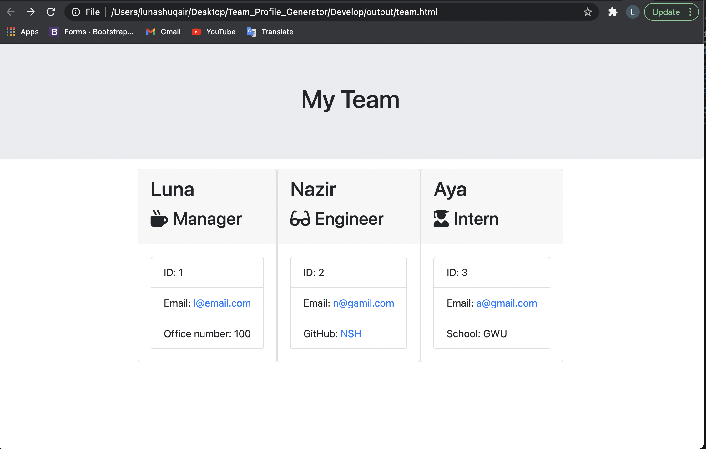

# team_profile_generator1

It's a software engineering team generator command line application. The application will prompt the user for information about the team manager and then information about the team members. The user can input any number of team members, and they may be a mix of engineers and interns. This application will pass all unit tests. When the user has completed building the team, the application will create an HTML file that displays the team's information based on  the user's entry

## LINK TO THE REPOSITORY

-  [team_profile_generator1](https://github.com/LShuqair/team_profile_generator1)

## LINK TO THE VIDEO
-  [team_profile_generator1](https://drive.google.com/file/d/1CYHfhlYNvpTuenh8hl_ws3WSJXlo9FA3/view?usp=sharing)

## SCREENSHOTS

